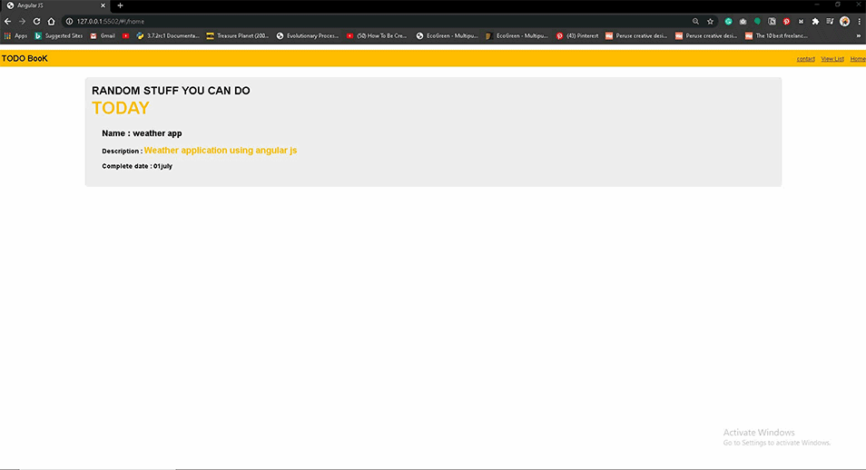
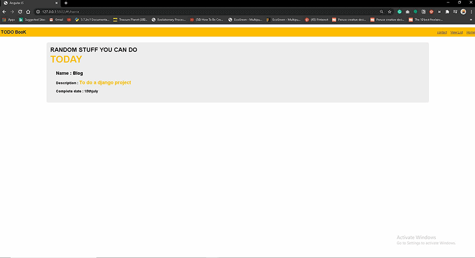
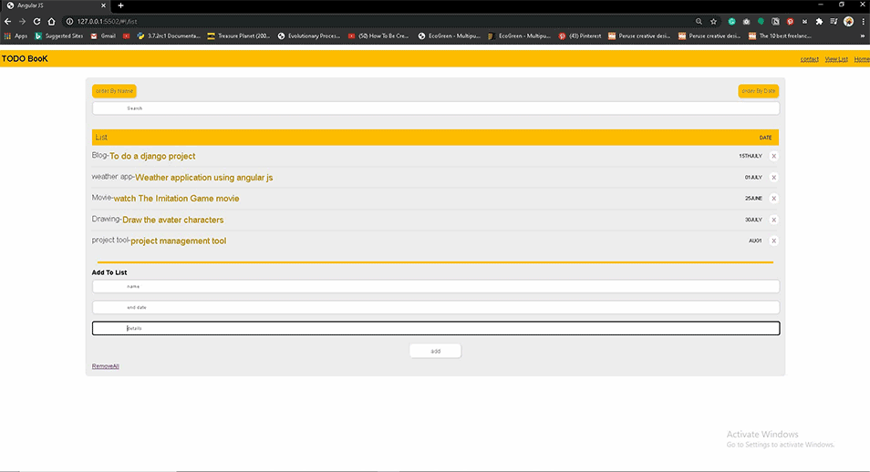
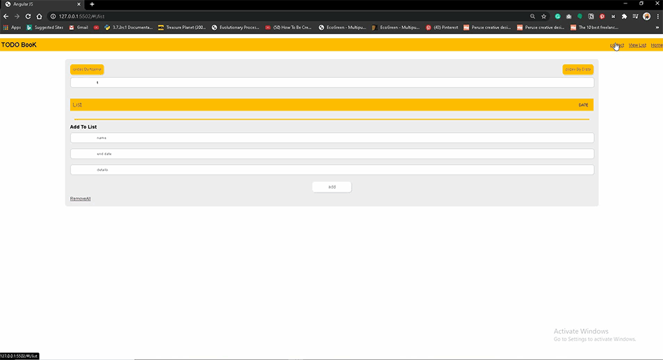

# Angularjs-Basic
Building a todo list with angularjs

[Source Youtube Toutorial](https://www.youtube.com/watch?v=FlUCU13dJyo&list=PL4cUxeGkcC9gsJS5QgFT2IvWIX78dV3_v)

#### Connecting with angularjs

```javascript
var mgodapp = angular.module('mgodapp'['ngRoute','ngAnimate'])
```

#### Connecting module with html

```html
<html lang="en" ng-app="mgodapp">
```

#### Generating random todo work


#### Adding to the todo list
 

#### ng-Animate functionality


#### form validation using angularjs
